# 🏗️ DSFarm - Multi-Animal Farm Management Architecture

> **Visi:** Platform manajemen peternakan multi-jenis hewan yang scalable  
> **Target:** Commercial product untuk peternak Indonesia  
> **Creator:** Fashrif

---

## 🎯 Product Vision

```mermaid
graph LR
    subgraph "DSFarm Platform"
        CORE[🔧 Core Platform]
        
        CORE --> R[🐰 Kelinci Module]
        CORE --> G[🐐 Kambing/Domba Module]
        CORE --> F[🐟 Ikan Module]
        CORE --> P[🐔 Unggas Module]
    end
    
    R --> |"Phase 1"|LAUNCH1[MVP Launch]
    G --> |"Phase 2"|LAUNCH2[Feature Update]
    F --> |"Phase 3"|LAUNCH3[Feature Update]
    P --> |"Phase 4"|LAUNCH4[Feature Update]
```



---

## 📊 Animal Module Priority

| Priority | Animal | Status | Use Case |
|----------|--------|--------|----------|
| 🥇 **P1** | Kelinci | 🟡 Building | Usaha sendiri, proving ground |
| 🥈 **P2** | Kambing/Domba | ⚪ Planned | Rencana usaha kedepan |
| 🥉 **P3** | Ikan (Gabus/Chana) | ⚪ Planned | Investasi breeding |
| 4️⃣ **P4** | Unggas | ⚪ Backlog | Future expansion |

---

## 🗄️ Database Schema (Multi-Farm)

### Core Tables (Shared)

```sql
-- ═══════════════════════════════════════════════════════════
-- USERS & FARMS
-- ═══════════════════════════════════════════════════════════

-- Users (existing, enhanced)
CREATE TABLE users (
  id UUID PRIMARY KEY REFERENCES auth.users(id),
  email TEXT NOT NULL,
  full_name TEXT,
  phone TEXT,
  avatar_url TEXT,
  subscription_tier TEXT DEFAULT 'free', -- free, pro, enterprise
  created_at TIMESTAMPTZ DEFAULT NOW()
);

-- Farms (NEW - satu user bisa punya banyak farm)
CREATE TABLE farms (
  id UUID PRIMARY KEY DEFAULT gen_random_uuid(),
  user_id UUID REFERENCES users(id) ON DELETE CASCADE,
  name TEXT NOT NULL,                    -- "Peternakan Kelinci Makmur"
  animal_type TEXT NOT NULL,             -- 'rabbit', 'goat', 'fish', 'poultry'
  location TEXT,
  description TEXT,
  is_active BOOLEAN DEFAULT true,
  created_at TIMESTAMPTZ DEFAULT NOW()
);

-- Animal Configs (settings per jenis hewan)
CREATE TABLE animal_configs (
  id UUID PRIMARY KEY DEFAULT gen_random_uuid(),
  animal_type TEXT UNIQUE NOT NULL,
  display_name TEXT NOT NULL,            -- "Kelinci", "Kambing"
  icon TEXT,                             -- emoji or icon name
  gestation_days INT,                    -- masa hamil
  weaning_days INT,                      -- masa sapih
  maturity_days INT,                     -- dewasa/siap kawin
  ready_sell_days INT,                   -- siap jual
  terminology JSONB,                     -- {"offspring": "anak", "housing": "kandang"}
  growth_stages JSONB,                   -- [{name: "anakan", min_days: 0, max_days: 30}]
  breeding_config JSONB,                 -- per-animal breeding settings
  created_at TIMESTAMPTZ DEFAULT NOW()
);

-- ═══════════════════════════════════════════════════════════
-- LIVESTOCK (Generic - works for all animals)
-- ═══════════════════════════════════════════════════════════

-- Housing (Kandang/Kolam/dll)
CREATE TABLE housings (
  id UUID PRIMARY KEY DEFAULT gen_random_uuid(),
  farm_id UUID REFERENCES farms(id) ON DELETE CASCADE,
  code TEXT NOT NULL,
  name TEXT,
  block TEXT,                            -- blok/area
  capacity INT DEFAULT 10,
  housing_type TEXT,                     -- 'individual', 'colony', 'pond'
  status TEXT DEFAULT 'active',
  notes TEXT,
  created_at TIMESTAMPTZ DEFAULT NOW(),
  UNIQUE(farm_id, code)
);

-- Livestock (Indukan/Pejantan)
CREATE TABLE livestocks (
  id UUID PRIMARY KEY DEFAULT gen_random_uuid(),
  farm_id UUID REFERENCES farms(id) ON DELETE CASCADE,
  housing_id UUID REFERENCES housings(id),
  code TEXT NOT NULL,
  name TEXT,
  gender TEXT NOT NULL,                  -- 'male', 'female'
  breed_id UUID REFERENCES breeds(id),
  birth_date DATE,
  acquisition_date DATE,
  acquisition_type TEXT,                 -- 'born', 'purchased', 'gifted'
  purchase_price DECIMAL(12,2),
  status TEXT DEFAULT 'active',          -- 'active', 'sold', 'deceased', 'culled'
  generation INT DEFAULT 1,
  weight DECIMAL(8,2),
  notes TEXT,
  metadata JSONB,                        -- flexible per-animal fields
  created_at TIMESTAMPTZ DEFAULT NOW(),
  UNIQUE(farm_id, code)
);

-- Offspring (Anak/Cempe/Bibit)
CREATE TABLE offsprings (
  id UUID PRIMARY KEY DEFAULT gen_random_uuid(),
  farm_id UUID REFERENCES farms(id) ON DELETE CASCADE,
  dam_id UUID REFERENCES livestocks(id), -- induk betina
  sire_id UUID REFERENCES livestocks(id),-- induk jantan
  housing_id UUID REFERENCES housings(id),
  code TEXT,
  gender TEXT,
  birth_date DATE NOT NULL,
  weaning_date DATE,
  birth_weight DECIMAL(8,2),
  current_weight DECIMAL(8,2),
  status TEXT DEFAULT 'infarm',          -- 'infarm', 'sold', 'deceased', 'promoted'
  promoted_to_livestock_id UUID REFERENCES livestocks(id),
  sale_price DECIMAL(12,2),
  sale_date DATE,
  notes TEXT,
  metadata JSONB,
  created_at TIMESTAMPTZ DEFAULT NOW()
);

-- ═══════════════════════════════════════════════════════════
-- BREEDING (Generic with per-animal config)
-- ═══════════════════════════════════════════════════════════

CREATE TABLE breeding_records (
  id UUID PRIMARY KEY DEFAULT gen_random_uuid(),
  farm_id UUID REFERENCES farms(id) ON DELETE CASCADE,
  dam_id UUID REFERENCES livestocks(id) NOT NULL,
  sire_id UUID REFERENCES livestocks(id),
  mating_date DATE NOT NULL,
  expected_birth_date DATE,              -- calculated from animal_config
  palpation_date DATE,
  palpation_result TEXT,                 -- 'positive', 'negative', 'uncertain'
  actual_birth_date DATE,
  born_alive INT DEFAULT 0,
  born_dead INT DEFAULT 0,
  weaning_date DATE,
  weaned_count INT DEFAULT 0,
  notes TEXT,
  metadata JSONB,                        -- per-animal specific data
  created_at TIMESTAMPTZ DEFAULT NOW()
);

-- ═══════════════════════════════════════════════════════════
-- FINANCE (Shared across all farms)
-- ═══════════════════════════════════════════════════════════

CREATE TABLE transactions (
  id UUID PRIMARY KEY DEFAULT gen_random_uuid(),
  farm_id UUID REFERENCES farms(id) ON DELETE CASCADE,
  type TEXT NOT NULL,                    -- 'income', 'expense'
  category_id UUID REFERENCES finance_categories(id),
  amount DECIMAL(12,2) NOT NULL,
  description TEXT,
  transaction_date DATE NOT NULL,
  reference_type TEXT,                   -- 'livestock_sale', 'feed_purchase', etc
  reference_id UUID,                     -- link to related record
  created_at TIMESTAMPTZ DEFAULT NOW()
);

-- ═══════════════════════════════════════════════════════════
-- MASTER DATA (Per Farm)
-- ═══════════════════════════════════════════════════════════

CREATE TABLE breeds (
  id UUID PRIMARY KEY DEFAULT gen_random_uuid(),
  farm_id UUID REFERENCES farms(id) ON DELETE CASCADE,
  animal_type TEXT NOT NULL,
  code TEXT NOT NULL,
  name TEXT NOT NULL,
  description TEXT,
  UNIQUE(farm_id, code)
);

CREATE TABLE feed_types (
  id UUID PRIMARY KEY DEFAULT gen_random_uuid(),
  farm_id UUID REFERENCES farms(id) ON DELETE CASCADE,
  name TEXT NOT NULL,
  unit TEXT DEFAULT 'kg',
  UNIQUE(farm_id, name)
);

CREATE TABLE finance_categories (
  id UUID PRIMARY KEY DEFAULT gen_random_uuid(),
  farm_id UUID REFERENCES farms(id) ON DELETE CASCADE,
  type TEXT NOT NULL,                    -- 'income', 'expense'
  name TEXT NOT NULL,
  parent_id UUID REFERENCES finance_categories(id),
  UNIQUE(farm_id, type, name)
);
```

---

## 📁 Flutter Project Structure

```
lib/
├── main.dart
├── app.dart                          # App configuration
│
├── core/                             # 🔧 SHARED - Semua hewan pakai
│   ├── constants/
│   │   ├── app_constants.dart
│   │   └── api_constants.dart
│   ├── theme/
│   │   ├── app_theme.dart
│   │   ├── colors.dart
│   │   └── typography.dart
│   ├── utils/
│   │   ├── date_utils.dart
│   │   ├── currency_utils.dart
│   │   └── validators.dart
│   ├── widgets/                      # Reusable widgets
│   │   ├── buttons/
│   │   ├── cards/
│   │   ├── forms/
│   │   ├── modals/
│   │   └── loading/
│   └── services/
│       ├── supabase_service.dart
│       └── notification_service.dart
│
├── models/                           # 📦 Data Models
│   ├── user.dart
│   ├── farm.dart
│   ├── animal_config.dart
│   ├── housing.dart
│   ├── livestock.dart
│   ├── offspring.dart
│   ├── breeding_record.dart
│   ├── transaction.dart
│   └── ...
│
├── repositories/                     # 🗄️ Data Access Layer
│   ├── base_repository.dart
│   ├── auth_repository.dart
│   ├── farm_repository.dart
│   ├── livestock_repository.dart
│   ├── offspring_repository.dart
│   ├── breeding_repository.dart
│   └── transaction_repository.dart
│
├── providers/                        # 🔄 State Management (Riverpod)
│   ├── auth_provider.dart
│   ├── farm_provider.dart
│   ├── current_farm_provider.dart    # Active farm context
│   ├── livestock_provider.dart
│   └── ...
│
├── features/                         # 📱 Screens & UI
│   │
│   ├── auth/                         # 🔐 Authentication
│   │   ├── screens/
│   │   │   ├── login_screen.dart
│   │   │   ├── register_screen.dart
│   │   │   └── forgot_password_screen.dart
│   │   └── widgets/
│   │
│   ├── farm_selector/                # 🏠 Farm Selection (NEW)
│   │   ├── screens/
│   │   │   ├── farm_list_screen.dart
│   │   │   └── create_farm_screen.dart
│   │   └── widgets/
│   │       └── farm_card.dart
│   │
│   ├── dashboard/                    # 📊 Dashboard (per farm)
│   │   ├── screens/
│   │   │   └── dashboard_screen.dart
│   │   └── widgets/
│   │       ├── summary_cards.dart
│   │       ├── recent_activities.dart
│   │       └── quick_actions.dart
│   │
│   ├── housing/                      # 🏠 Kandang/Kolam
│   │   ├── screens/
│   │   └── widgets/
│   │
│   ├── livestock/                    # 🐾 Indukan/Pejantan
│   │   ├── screens/
│   │   │   ├── livestock_list_screen.dart
│   │   │   └── livestock_detail_screen.dart
│   │   └── widgets/
│   │       ├── livestock_card.dart
│   │       └── livestock_form.dart
│   │
│   ├── offspring/                    # 🐣 Anak/Cempe/Bibit
│   │   ├── screens/
│   │   └── widgets/
│   │
│   ├── breeding/                     # 💕 Breeding Records
│   │   ├── screens/
│   │   └── widgets/
│   │
│   ├── finance/                      # 💰 Keuangan
│   │   ├── screens/
│   │   └── widgets/
│   │
│   ├── inventory/                    # 📦 Stok & Peralatan
│   │   ├── screens/
│   │   └── widgets/
│   │
│   └── settings/                     # ⚙️ Pengaturan
│       ├── screens/
│       │   ├── settings_screen.dart
│       │   ├── profile_screen.dart
│       │   └── master_data_screen.dart
│       └── widgets/
│
└── animal_modules/                   # 🐾 ANIMAL-SPECIFIC LOGIC
    │
    ├── base/                         # Abstract base
    │   ├── animal_module.dart        # Interface
    │   └── animal_config_loader.dart
    │
    ├── rabbit/                       # 🐰 Kelinci Module
    │   ├── rabbit_module.dart
    │   ├── rabbit_config.dart        # Gestation 30d, weaning 35d, etc
    │   └── widgets/                  # Kelinci-specific widgets if any
    │
    ├── goat/                         # 🐐 Kambing Module
    │   ├── goat_module.dart
    │   └── goat_config.dart          # Gestation 150d, etc
    │
    ├── fish/                         # 🐟 Ikan Module
    │   ├── fish_module.dart
    │   └── fish_config.dart          # Spawning cycle, pond management
    │
    └── poultry/                      # 🐔 Unggas Module
        ├── poultry_module.dart
        └── poultry_config.dart       # Egg laying, incubation
```

---

## 🔄 App Flow (Multi-Farm)


---

## 🐾 Animal Configuration Example

```dart
// lib/animal_modules/rabbit/rabbit_config.dart

class RabbitConfig extends AnimalConfig {
  @override
  String get animalType => 'rabbit';
  
  @override
  String get displayName => 'Kelinci';
  
  @override
  String get icon => '🐰';
  
  @override
  int get gestationDays => 31;  // Masa hamil
  
  @override
  int get weaningDays => 35;    // Masa sapih dari lahir
  
  @override
  int get maturityDays => 150;  // Siap kawin
  
  @override
  int get readySellDays => 90;  // Siap jual
  
  @override
  Map<String, String> get terminology => {
    'offspring': 'Anak Kelinci',
    'housing': 'Kandang',
    'dam': 'Induk Betina',
    'sire': 'Pejantan',
    'mating': 'Kawin',
    'palpation': 'Palpasi',
  };
  
  @override
  List<GrowthStage> get growthStages => [
    GrowthStage(name: 'Anakan', minDays: 0, maxDays: 35),
    GrowthStage(name: 'Lepas Sapih', minDays: 36, maxDays: 60),
    GrowthStage(name: 'Remaja', minDays: 61, maxDays: 90),
    GrowthStage(name: 'Siap Jual', minDays: 91, maxDays: 150),
    GrowthStage(name: 'Dewasa', minDays: 151, maxDays: null),
  ];
}
```

```dart
// lib/animal_modules/goat/goat_config.dart

class GoatConfig extends AnimalConfig {
  @override
  String get animalType => 'goat';
  
  @override
  String get displayName => 'Kambing';
  
  @override
  String get icon => '🐐';
  
  @override
  int get gestationDays => 150;  // 5 bulan
  
  @override
  int get weaningDays => 90;     // 3 bulan
  
  @override
  int get maturityDays => 365;   // 1 tahun
  
  @override
  int get readySellDays => 180;  // 6 bulan
  
  @override
  Map<String, String> get terminology => {
    'offspring': 'Cempe',
    'housing': 'Kandang',
    'dam': 'Induk Betina',
    'sire': 'Pejantan',
    'mating': 'Kawin',
    'palpation': 'Periksa Kebuntingan',
  };
  
  @override
  List<GrowthStage> get growthStages => [
    GrowthStage(name: 'Cempe', minDays: 0, maxDays: 90),
    GrowthStage(name: 'Lepas Sapih', minDays: 91, maxDays: 180),
    GrowthStage(name: 'Dara/Muda', minDays: 181, maxDays: 365),
    GrowthStage(name: 'Dewasa', minDays: 366, maxDays: null),
  ];
}
```

---

## 💰 Subscription Tiers (Commercial)

```dart
enum SubscriptionTier {
  free,       // 1 farm, max 50 livestock
  pro,        // 3 farms, unlimited livestock
  enterprise, // Unlimited farms, team access
}
```

| Feature | Free | Pro | Enterprise |
|---------|------|-----|------------|
| Farms | 1 | 3 | Unlimited |
| Livestock | 50 | Unlimited | Unlimited |
| Team Members | 1 | 3 | Unlimited |
| Reports | Basic | Full | Custom |
| Export | - | CSV | CSV + PDF |
| Support | Community | Email | Priority |
| Price | Rp 0 | Rp 50K/bln | Rp 200K/bln |

---

## 📅 Updated Roadmap

### Phase 1: Foundation + Multi-Farm (Week 1-2)
- Auth dengan Supabase
- Farm CRUD (create, select, switch)
- Animal config loader
- Basic Kelinci module

### Phase 2: Kelinci MVP (Week 3-5)
- Kandang, Livestock, Offspring CRUD
- Breeding records
- Finance dasar

### Phase 3: Polish + Kambing (Week 6-8)
- UI/UX improvements
- Kambing module
- Cross-farm reports

### Phase 4: Ikan + Release (Week 9-12)
- Fish module (pond management)
- Play Store release
- Beta testing

### Phase 5: Growth (Post-Launch)
- Unggas module
- Subscription system
- Team features

---

## 🔑 Key Decisions Summary

| Decision | Choice | Reason |
|----------|--------|--------|
| State Management | Riverpod | Modern, testable, compile-safe |
| Database | Supabase | Already used in PWA, realtime |
| Multi-farm | Farm selector screen | User dapat switch antar farm |
| Animal logic | Config-driven | Extensible, no code duplication |
| Commercial | Freemium model | Free to try, pay for more |

---

**Last Updated:** 2025-12-20  
**Author:** Claude (with Fashrif)
