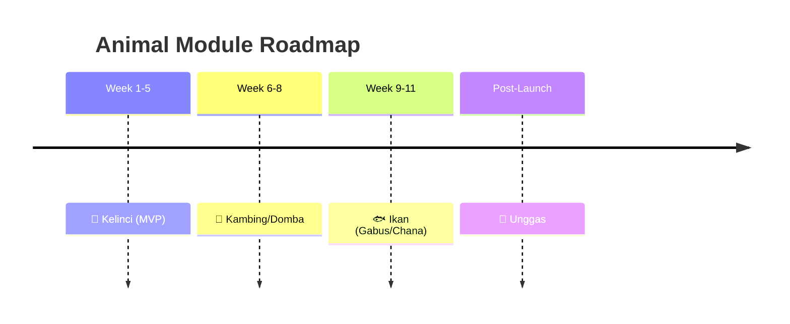
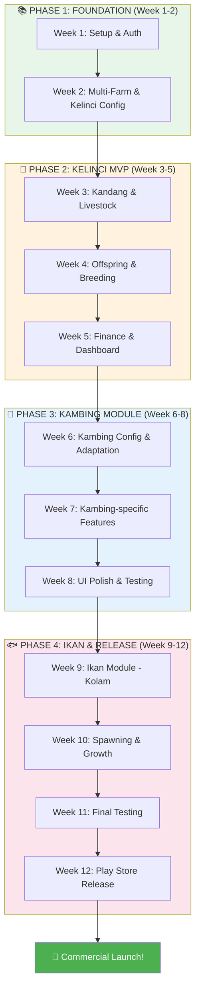
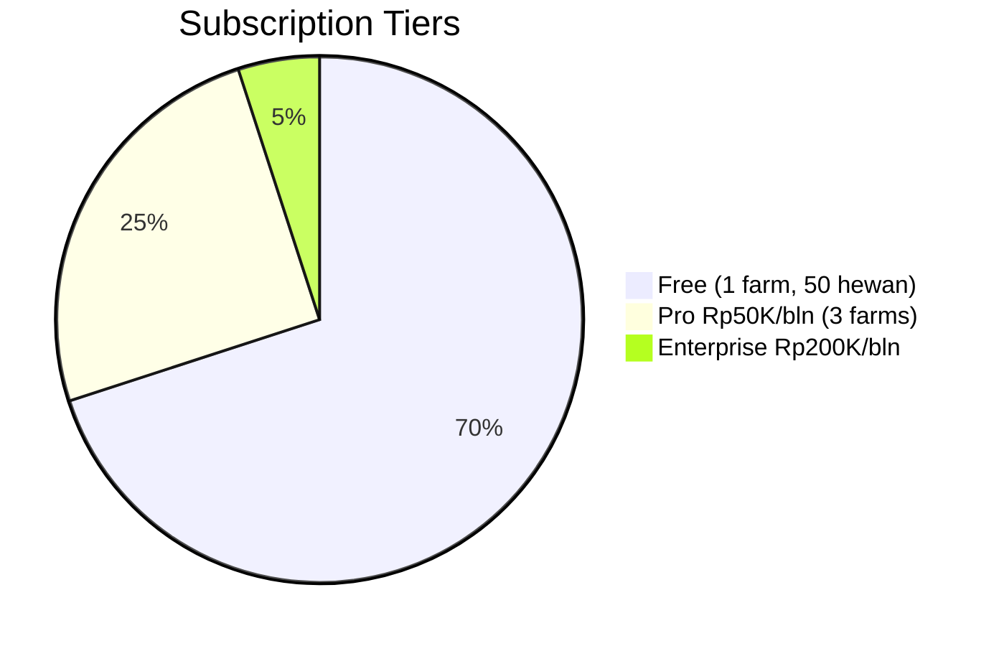

# 🗺️ DSFarm - Multi-Animal Farm Management

> **Visi:** Platform manajemen peternakan multi-jenis hewan untuk peternak Indonesia  
> **Business Model:** Commercial (Freemium)  
> **Target:** 12 Weeks to MVP Launch  
> **Tech Stack:** Flutter + Supabase + Riverpod + GoRouter

---

## 🐾 Animal Module Priority

| Priority | Animal | Your Use Case |
|----------|--------|---------------|
| 🥇 **P1** | Kelinci | Usaha sendiri sekarang |
| 🥈 **P2** | Kambing/Domba | Rencana usaha kedepan |
| 🥉 **P3** | Ikan Gabus/Chana | Investasi breeding |
| 4️⃣ **P4** | Unggas | Future expansion |

---

## 📊 Visual Roadmap

---

## 📅 Week-by-Week Breakdown

### ═══════════════════════════════════════
### 📚 PHASE 1: FOUNDATION (Week 1-2)
### ═══════════════════════════════════════

---

### Week 01: Setup & Auth 🚀
**Status:** 🟡 In Progress  
**File:** `devlogs/Week-01-Foundation.md`

**Objectives:**
- [x] Flutter project setup
- [ ] Supabase SDK integration
- [ ] Login & Register screens
- [ ] Auth state management (Riverpod)
- [ ] GoRouter + Protected routes

**Learning Goals:**
- Dart null safety (`?`, `!`, `??`)
- Widget tree composition
- StatelessWidget vs StatefulWidget
- Riverpod basics

---

### Week 02: Multi-Farm Architecture 🏠
**Status:** ⚪ Pending

**Objectives:**
- [ ] Farm model & repository
- [ ] Create Farm screen
- [ ] Farm selector screen
- [ ] Switch farm functionality
- [ ] AnimalConfig base class
- [ ] RabbitConfig implementation
- [ ] Current farm provider (context)

**Learning Goals:**
- Repository pattern
- Abstract classes & interfaces
- Config-driven architecture
- Provider family (Riverpod)

---

### ═══════════════════════════════════════
### 🐰 PHASE 2: KELINCI MVP (Week 3-5)
### ═══════════════════════════════════════

---

### Week 03: Kandang & Livestock 🏠🐾
**Status:** ⚪ Pending

**Objectives:**
- [ ] Housing model & repository
- [ ] Housing CRUD screens
- [ ] Livestock model & repository
- [ ] Livestock list with filters
- [ ] Livestock detail modal
- [ ] Add/Edit livestock form

**Learning Goals:**
- Supabase CRUD operations
- ListView & FutureBuilder
- Modal bottom sheets
- Form handling in Flutter

---

### Week 04: Offspring & Breeding 🐣💕
**Status:** ⚪ Pending

**Objectives:**
- [ ] Offspring model & repository
- [ ] Offspring list (grouped by dam)
- [ ] Offspring detail & promote to livestock
- [ ] Breeding record model
- [ ] Breeding form (mating, palpasi, lahir, sapih)
- [ ] Auto-calculate expected dates

**Learning Goals:**
- Relational queries in Supabase
- Date calculations
- Complex forms
- State management across screens

---

### Week 05: Finance & Dashboard 💰📊
**Status:** ⚪ Pending

**Objectives:**
- [ ] Transaction model & repository
- [ ] Income/Expense form
- [ ] Transaction list with filters
- [ ] Dashboard screen
- [ ] Summary cards
- [ ] Charts (fl_chart)
- [ ] Recent activities

**Learning Goals:**
- Number formatting (currency)
- Data aggregation
- Charts in Flutter
- Pull-to-refresh

---

### ═══════════════════════════════════════
### 🐐 PHASE 3: KAMBING MODULE (Week 6-8)
### ═══════════════════════════════════════

---

### Week 06: Kambing Config & Adaptation 🐐
**Status:** ⚪ Pending

**Objectives:**
- [ ] GoatConfig implementation
- [ ] Update DB for goat-specific fields
- [ ] Test multi-farm switching
- [ ] Terminology adaptation (Cempe, dll)
- [ ] Growth stage differences

**Learning Goals:**
- Polymorphism in practice
- Config-driven UI
- Multi-tenant patterns

---

### Week 07: Kambing-specific Features 🐐
**Status:** ⚪ Pending

**Objectives:**
- [ ] Longer breeding cycle handling
- [ ] Weight tracking enhancements
- [ ] Wool/Meat category (for sheep)
- [ ] Health records
- [ ] Vaccination schedule

**Learning Goals:**
- Feature flags
- Conditional UI rendering
- Domain-specific logic

---

### Week 08: UI Polish & Testing ✨
**Status:** ⚪ Pending

**Objectives:**
- [ ] Consistent design system
- [ ] Loading states & skeletons
- [ ] Error handling UI
- [ ] Empty states
- [ ] Widget tests
- [ ] Integration tests

**Learning Goals:**
- Custom themes
- Shimmer loading
- Flutter testing
- Code quality

---

### ═══════════════════════════════════════
### 🐟 PHASE 4: IKAN & RELEASE (Week 9-12)
### ═══════════════════════════════════════

---

### Week 09: Ikan Module - Kolam 🐟
**Status:** ⚪ Pending

**Objectives:**
- [ ] FishConfig implementation
- [ ] Kolam (pond) vs Kandang adaptation
- [ ] Water quality tracking
- [ ] Kolam capacity in volume/weight

**Learning Goals:**
- Domain adaptation (aquaculture)
- Unit conversions
- Sensor data (future)

---

### Week 10: Spawning & Growth 🐟
**Status:** ⚪ Pending

**Objectives:**
- [ ] Spawning records (vs breeding)
- [ ] Bibit/Benih tracking
- [ ] Harvest records (panen)
- [ ] Mortality tracking
- [ ] Feed conversion ratio

**Learning Goals:**
- Batch processing
- Statistical calculations
- Report generation

---

### Week 11: Final Testing 🧪
**Status:** ⚪ Pending

**Objectives:**
- [ ] Full app testing on devices
- [ ] Performance profiling
- [ ] Memory optimization
- [ ] Bug fixing sprint
- [ ] User acceptance testing

**Learning Goals:**
- DevTools profiling
- Release optimization
- UAT process

---

### Week 12: Play Store Release 🚀
**Status:** ⚪ Pending

**Objectives:**
- [ ] App icon & splash screen
- [ ] Build signed APK/AAB
- [ ] Play Store listing
- [ ] Screenshots & descriptions
- [ ] Beta release
- [ ] Gather feedback

**Learning Goals:**
- App distribution
- Store optimization (ASO)
- Beta testing workflow

---

## 🎯 Milestone Checkpoints

| Milestone | Week | Deliverable |
|-----------|------|-------------|
| ✅ Auth Ready | 1 | Login/Register working |
| 🏠 Multi-Farm | 2 | Farm switching works |
| 🐰 Kelinci MVP | 5 | Full rabbit farm management |
| 🐐 Kambing Ready | 8 | Goat module integrated |
| 🐟 Ikan Ready | 10 | Fish module working |
| 🚀 Launch | 12 | Play Store published |

---

## 💰 Revenue Model (Post-Launch)

| Tier | Farms | Livestock | Price |
|------|-------|-----------|-------|
| Free | 1 | 50 max | Rp 0 |
| Pro | 3 | Unlimited | Rp 50.000/bln |
| Enterprise | ∞ | Unlimited + Team | Rp 200.000/bln |

---

## 📚 Documentation Files

| File | Purpose |
|------|---------|
| `ROADMAP.md` | This file - timeline & milestones |
| `ARCHITECTURE.md` | Technical design & database schema |
| `agents.md` | AI collaboration guidelines |
| `devlogs/Week-XX.md` | Weekly progress & checklists |

---

## 🔑 Key Decisions

1. **Multi-Farm First:** Arsitektur multi-farm dari awal, bukan retrofit nanti
2. **Config-Driven:** Animal behavior via config, bukan hardcode
3. **Commercial Ready:** Subscription infrastructure from week 1
4. **Mobile First:** Flutter for Android (iOS later)

---

**Last Updated:** 2025-12-20
